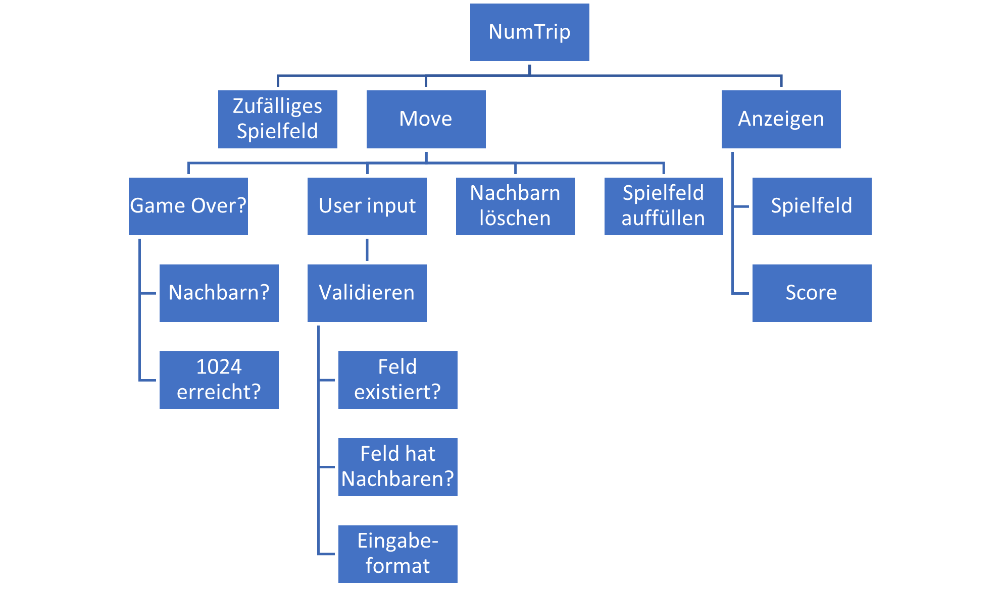

# NumTrip
## Konsolen- und Fensterbasiert

### Ziel des spiels
Im Spiel NumTrip können in einem Spielfeld Felder, welche einen Wert besitzen, kombiniert werden. Dabei werden alle Nachbarfelder absorbiert, welche den selben Wert haben wie das ausgewählte Feld. Das Ziel des Spiels ist es, bis zum erreichen eines Feldes mit dem Wert 1024 einen möglichst hohen Score zu erzielen, ohne Game Over zu gehen. Game Over ist man, wenn keine Felder mehr kombiniert werden können und der Score wird berechnet, indem die Anzahl im Zug absorbierter Felder mit dem Wert des resultierenden Feldes multipliziert und zu dem vorherigen Score addiert wird.

### Top-Down Entwurf
Der Top-Down Entwurf meines NumTrip Spiels sieht wiefolgt aus:

### Auffüllen des Spielfelds
Das Auffüllen des Spielfeldes habe ich auf eine meiner Meinung nach naheliegende und doch kreative Art gelöst. Der Ablauf ist ziemlich simpel und beinhaltet nur wenige Schritte. Das Spielfeld ist bei der Übergabe in die Funktion als zweidimensionale Liste Zeile um Zeile gespeichert. Im ersten Schritt wird das Spielfeld quasi rotiert, so dass das Spielfeld nun Spalte um Spalte in der Liste gespeichert ist.

    columns = [[board[j][i] for j in range(len(board))] for i in range(len(board[0]))]

Danach wird durch jede Spalte iteriert und überprüft, ob sich in ihr Felder mit dem Wert -1 befinden. Ist dies der Fall, wird die Liste mit der Spalte umgekehrt, damit sie die Felder in der Reihenfolge unten -> oben enthält. Für jedes Feld mit dem Wert -1 in der Spalte wird nun eben dieses Feld entfernt und ein neues Feld mit einem zufälligen Wert 2, 4, oder 8 hinzugefügt. Die Liste wird am Schluss erneut umgekehrt, damit sie die Felder wieder in der ursprünglichen Anordnung enthält.

    if -1 in column:
        column.reverse()
        for i in range(column.count(-1)):
            column.pop(column.index(-1))
            column.append(2 ** random.randint(1, 3))
        column.reverse()

Dieses Vorgehen macht das Prinzip der "Gravitation", welche in dem Spiel implementiert ist, ganz natürlich, da die Felder mit dem Wert -1 aus beliebigen Positionen entfernt werden, die neuen Felder aber immer an der obersten Position angefügt werden.

Schlussendlich wird das Spielfeld zurück in seine urspüngliche From rotiert und zurückgegeben.

    return [[columns[j][i] for j in range(len(columns))] for i in range(len(columns[0]))]

### Herausforderungen und Tipps
Die grösste Herausforderung, die mir beim Entwickeln des Spiels in den Weg kam, war, oft simple aber dafür umso hartnäckigere Fehler zu finden. Syntaxfehler oder fehlender Code sind schnell zu beheben, bei tief sitzenden Logikfehlern oder unüberlegtem gebrauchen von Funktionen, wie bei mir die list.index() Funktion, sind oftmals schwierig zu finden, da man ihnen zu wenig Beachtung schenkt oder sich nicht gut genug mit ihnen beschäftigt. Es lohnt sich also, auch kleine Details in seinem Code zu überdenken und zu hinterfragen, ob man wirklich versteht was er macht. Um Logikfehler schnell zu finden und sogar vorzubeugen ist es ratsam, einen sehr genauen Plan zu haben, was man überhaupt programmieren will. Wildes Drauflosschreiben führt sehr schnell zu einem sehr grossen Chaos.